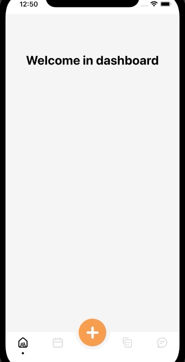

# Custom animated bottom tab and drawer navigation in React-Native.

# Introduction

This is a repository for the article about building the custom bottom bar navigation. Full article is available [here](#link-to-add).

# Instructions

## Branches

    The master branch contains the code of the finished application.

    The nav-starter branch has a core setup. It's for people, who wants to follow the article, and write code by themself.

## Start application

It doesn't require any additional setup. Just clone the repository, install dependencies, and you're ready to go.

# Result

